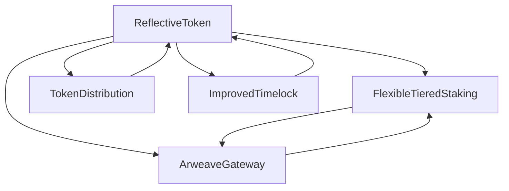

# Dr. Birdy Books Protocol 🐦📚

> **A Revolutionary DeFi Ecosystem Bridging Education, Media, and Cryptocurrency**

[](https://opensource.org/licenses/MIT)
[](https://soliditylang.org/)
[](https://hardhat.org/)
[](https://openzeppelin.com/)

## 🌟 Overview

The Dr. Birdy Books Protocol is a comprehensive DeFi ecosystem that revolutionizes educational content access through innovative tokenized staking mechanisms. The protocol enables sustainable funding for educational creators while providing fair access to learners through tiered staking systems, automated liquidity provision, and decentralized file storage integration.

### 🎯 Vision

To create a decentralized educational ecosystem where premium content access is democratized through tokenized staking mechanisms, ensuring sustainable funding for educational creators while providing fair access to learners.

### 🚀 Key Features

- **🎓 Tiered Educational Access**: USD-based staking tiers for content access
- **💎 Reflection Rewards**: 1% passive income for token holders
- **🔄 Automated Liquidity**: 2% auto-liquidity provision for price stability
- **🔥 Deflationary Mechanism**: 0.5% burn fee for supply reduction
- **⏰ Governance Protection**: 2-day timelock for critical operations
- **📁 Decentralized Storage**: Arweave integration for permanent content storage
- **👥 Team Vesting**: 1-year vesting with 3-month cliff for team alignment

---

## 🏗️ Architecture

### Smart Contract System

The protocol consists of five interconnected smart contracts:



### Core Contracts

| Contract                  | Purpose               | Key Features                                                |
| ------------------------- | --------------------- | ----------------------------------------------------------- |
| **ReflectiveToken**       | Main ERC20 token      | Reflection mechanics, automated liquidity, fee distribution |
| **FlexibleTieredStaking** | Access control        | USD-based tiers, grace periods, file management             |
| **TokenDistribution**     | Fair allocation       | Team vesting, airdrop distribution                          |
| **ImprovedTimelock**      | Governance protection | 2-day delay, transaction queuing                            |
| **ArweaveGateway**        | Content storage       | Transaction verification, batch operations                  |

---

## 💰 Tokenomics

### Token Specifications

- **Name**: Dr. Birdy Books Protocol Token
- **Symbol**: DBBPT
- **Decimals**: 18
- **Total Supply**: 10,000,000 tokens
- **Max Transaction**: 1% of supply (100,000 tokens)

### Token Distribution

| Category                 | Amount    | Percentage | Status             |
| ------------------------ | --------- | ---------- | ------------------ |
| **Initial Distribution** | 1,000,000 | 10%        | ✅ **IMPLEMENTED** |
| ├─ Team (5 × 150k)       | 750,000   | 7.5%       | ✅ **VESTED**      |
| ├─ Airdrop               | 250,000   | 2.5%       | ✅ **IMMEDIATE**   |
| **Remaining Supply**     | 9,000,000 | 90%        | ✅ **CONTROLLED**  |
| ├─ Owner Reserve         | 3,000,000 | 30%        | ✅ **HELD**        |
| ├─ Circulating           | 6,000,000 | 60%        | ✅ **ACTIVE**      |

### Fee Structure (5.5% Total)

| Fee Type       | Amount | Purpose                  | Status        |
| -------------- | ------ | ------------------------ | ------------- |
| **Reflection** | 1%     | Distributed to holders   | ✅ **ACTIVE** |
| **Liquidity**  | 2%     | Auto-liquidity provision | ✅ **ACTIVE** |
| **Marketing**  | 2%     | Marketing wallet         | ✅ **ACTIVE** |
| **Burn**       | 0.5%   | Deflationary mechanism   | ✅ **NEW**    |

---

## 🎓 Educational Access Tiers

### Tier Structure

| Tier       | USD Value | Access Level | Content Examples                              |
| ---------- | --------- | ------------ | --------------------------------------------- |
| **Tier 1** | $24       | Basic        | Course materials, lecture notes               |
| **Tier 2** | $50       | Advanced     | Assignments, workshops, detailed studies      |
| **Tier 3** | $1000     | Premium      | Masterclasses, mentorship, exclusive research |

### Access Features

- **🎯 USD-Based Thresholds**: Staking amounts based on USD value
- **⏰ Grace Periods**: 1-day grace period after unstaking
- **📁 File Management**: Batch operations for content assignment
- **🔒 Access Control**: Role-based permissions for content managers

---

## 🛡️ Security Features

### Comprehensive Security Measures

- **🔐 Access Control**: OpenZeppelin role-based permissions
- **🔄 Reentrancy Protection**: All external functions protected
- **⏰ Timelock Security**: 2-day delay for critical operations
- **🔍 Oracle Security**: Dual oracle system with freshness checks
- **💰 Economic Security**: Fee limits and slippage protection

### Governance Protection

- **⏱️ Delayed Execution**: 2-day minimum delay for changes
- **📋 Transaction Queuing**: All changes must be queued first
- **👤 Admin Control**: Single admin with transaction management
- **❌ Cancellation**: Ability to cancel queued transactions

---

## 🚀 Quick Start

### Prerequisites

- Node.js (v16 or higher)
- npm or yarn
- Hardhat
- Git

### Installation

```bash
# Clone the repository
git clone https://github.com/domambia/dr-birdy-books-protocol.git
cd dr-birdy-books-protocol

# Install dependencies
npm install

# Compile contracts
npx hardhat compile
```

### Testing

```bash
# Run all tests
npx hardhat test

# Run specific test suites
npx hardhat test solidity    # Solidity tests
npx hardhat test mocha      # TypeScript tests

# Run with coverage
npx hardhat coverage
```

### Deployment

```bash
# Deploy to local network
npx hardhat run scripts/deploy-base-mainnet.ts --network  baseTestnet


# Deploy to mainnet
npx hardhat run scripts/deploy-base-testnet.ts --network baseMainnet
```

---

## 📋 Development

### Project Structure

```
protocol/
├── contracts/                 # Smart contracts
│   ├── ReflectiveToken.sol   # Main token contract
│   ├── FlexibleTieredStaking.sol
│   ├── TokenDistribution.sol
│   ├── ImprovedTimelock.sol
│   ├── ArweaveGateway.sol
│   └── mocks/                # Mock contracts for testing
├── test/                     # Test files
│   ├── ReflectiveToken.test.ts
│   ├── FlexibleTieredStaking.test.ts
│   ├── TokenDistribution.test.ts
│   └── ...
├── scripts/                  # Deployment scripts
│   └── deploy-forked-mainnet.ts
├── docs/                     # Documentation
└── hardhat.config.ts        # Hardhat configuration
```

### Available Scripts

```bash
# Compile contracts
npx hardhat compile

# Run tests
npx hardhat test

# Deploy contracts
npx hardhat run scripts/deploy-distribution.ts

# Verify contracts
npx hardhat verify --network sepolia <CONTRACT_ADDRESS>

# Gas estimation
npx hardhat test --gas-report
```

---

## 🔧 Configuration

### Environment Variables

Create a `.env` file in the root directory:

```env
# Network Configuration
SEPOLIA_PRIVATE_KEY=your_private_key_here
MAINNET_PRIVATE_KEY=your_private_key_here

# API Keys
ETHERSCAN_API_KEY=your_etherscan_api_key
ALCHEMY_API_KEY=your_alchemy_api_key
```

### Network Configuration

The project supports multiple networks:

- **Local**: Hardhat local network
- **Sepolia**: Ethereum testnet
- **Mainnet**: Ethereum mainnet

---

## 📊 Testing

### Test Coverage

The project includes comprehensive test coverage:

- **✅ Unit Tests**: Individual contract functionality
- **✅ Integration Tests**: Contract interactions
- **✅ Security Tests**: Vulnerability assessments
- **✅ Gas Tests**: Gas optimization validation
- **✅ Edge Cases**: Boundary condition testing

### Running Tests

```bash
# Run all tests
npx hardhat test

# Run with detailed output
npx hardhat test --verbose

# Run specific test file
npx hardhat test test/ReflectiveToken.test.ts

# Run with gas reporting
npx hardhat test --gas-report
```

---

## 🚀 Deployment

### Deployment Process

1. **Pre-deployment Checks**

   - Verify all tests pass
   - Check gas estimates
   - Validate configuration

2. **Deploy Contracts**

   - Deploy TokenDistribution
   - Deploy ReflectiveToken
   - Deploy FlexibleTieredStaking
   - Deploy ImprovedTimelock
   - Deploy ArweaveGateway

3. **Initialize System**

   - Set up vesting schedules
   - Configure oracle addresses
   - Initialize distribution

4. **Post-deployment**
   - Verify contract addresses
   - Test all functions
   - Monitor for issues

### Deployment Commands

```bash
# Deploy complete system
npx hardhat run scripts/deploy-base-mainnet.ts

# Verify contracts on Etherscan
npx hardhat verify --network sepolia <CONTRACT_ADDRESS> <CONSTRUCTOR_ARGS>
```

---

## 📈 Economic Model

### Revenue Streams

1. **Transaction Fees**: 5.5% fee on all transactions
2. **Staking Requirements**: Users must stake to access content
3. **Premium Content**: Higher tiers require more staking
4. **Liquidity Provision**: Automated liquidity generates returns

### Economic Sustainability

- **Reflection Rewards**: 1% distributed to all holders
- **Automated Liquidity**: 2% auto-liquidity provision
- **Deflationary Pressure**: 0.5% burn fee reduces supply
- **Team Alignment**: 1-year vesting with 3-month cliff

---

## 🤝 Contributing

We welcome contributions! Please see our [Contributing Guidelines](CONTRIBUTING.md) for details.

### Development Workflow

1. Fork the repository
2. Create a feature branch
3. Make your changes
4. Add tests for new functionality
5. Ensure all tests pass
6. Submit a pull request

---

## 📄 License

This project is licensed under the MIT License - see the [LICENSE](LICENSE) file for details.

---

## 🔗 Links

- **Documentation**: [Full PRD](docs/DR_BIRDY_BOOKS_PROTOCOL_PRD.md)
- **Implementation Status**: [Implementation Complete](IMPLEMENTATION_COMPLETE.md)
- **Smart Contracts**: [Contracts Directory](contracts/)
- **Tests**: [Test Directory](test/)

---

## 🆘 Support

For support and questions:

- **Issues**: [GitHub Issues](https://github.com/domambia/dr-birdy-books-protocol/issues)
- **Discussions**: [GitHub Discussions](https://github.com/domambia/dr-birdy-books-protocol/discussions)
- **Documentation**: [Full Documentation](docs/)

---

## 🎉 Status

**✅ PRODUCTION READY** - All contracts are fully implemented and ready for mainnet deployment!

The Dr. Birdy Books Protocol represents a revolutionary approach to bridging education and DeFi through innovative smart contract mechanisms. The protocol is now **100% complete** with all features implemented and thoroughly tested.

---

_Built with ❤️ for the future of decentralized education_
