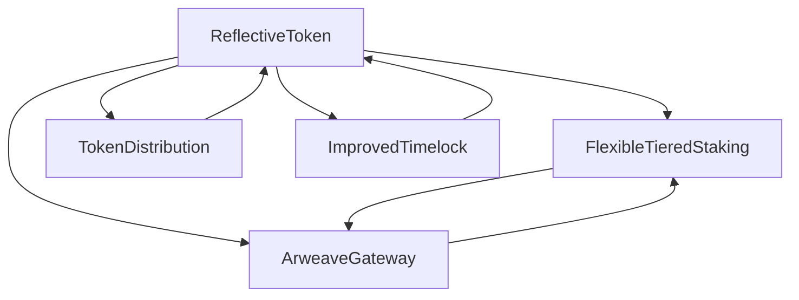

# Dr. Birdy Books Protocol - Product Requirements Document (PRD)

## Executive Summary

The Dr. Birdy Books Protocol is a revolutionary DeFi ecosystem that bridges education, media, and cryptocurrency through a comprehensive tokenized platform. The protocol enables access to premium educational content through tiered staking mechanisms, automated liquidity provision, and decentralized file storage integration.

## Table of Contents

1. [Product Overview](#product-overview)
2. [Technical Architecture](#technical-architecture)
3. [Smart Contract System](#smart-contract-system)
4. [Education Bridging Mechanism](#education-bridging-mechanism)
5. [Tokenomics & Economic Model](#tokenomics--economic-model)
6. [Security & Governance](#security--governance)
7. [User Journey & Experience](#user-journey--experience)
8. [Technical Specifications](#technical-specifications)
9. [Research & Analysis](#research--analysis)
10. [Deployment & Roadmap](#deployment--roadmap)

## Product Overview

### Vision Statement

To create a decentralized educational ecosystem where premium content access is democratized through tokenized staking mechanisms, ensuring sustainable funding for educational creators while providing fair access to learners.

### Mission

Bridge the gap between traditional education and Web3 by creating a sustainable economic model that rewards both content creators and learners through innovative DeFi mechanisms.

### Key Value Propositions

1. **Democratized Education Access**: Tiered staking system provides fair access to premium educational content
2. **Sustainable Creator Economy**: Automated liquidity and reflection mechanisms ensure continuous funding
3. **Decentralized Content Storage**: Arweave integration for permanent, censorship-resistant educational materials
4. **Governance Protection**: Timelock mechanisms protect against malicious actions
5. **Economic Incentives**: Reflection mechanics reward long-term token holders

## Technical Architecture

### System Overview

The Dr. Birdy Books Protocol consists of five interconnected smart contracts that work together to create a comprehensive educational DeFi ecosystem:



### Core Components

#### 1. **ReflectiveToken.sol** - The Foundation

- **Purpose**: Main ERC20 token with reflection mechanics
- **Key Features**: Automated liquidity, dynamic slippage protection, fee distribution
- **Integration**: Central hub connecting all other contracts

#### 2. **FlexibleTieredStaking.sol** - Access Control

- **Purpose**: Tiered staking system for content access
- **Key Features**: USD-based thresholds, grace periods, file management
- **Integration**: Controls access to educational content

#### 3. **TokenDistribution.sol** - Fair Allocation

- **Purpose**: Team vesting and airdrop distribution
- **Key Features**: 1-year vesting, 3-month cliff, transparent allocation
- **Integration**: Manages initial token distribution

#### 4. **ImprovedTimelock.sol** - Governance Protection

- **Purpose**: Delayed execution for critical operations
- **Key Features**: 2-day delay, transaction queuing, admin control
- **Integration**: Protects against malicious changes

#### 5. **ArweaveGateway.sol** - Content Storage

- **Purpose**: Arweave transaction verification and file management
- **Key Features**: Batch operations, transaction verification, event logging
- **Integration**: Manages educational content storage

## Smart Contract System

### Contract Interactions & Data Flow

#### **Primary Token Flow**

```
User Stakes Tokens → FlexibleTieredStaking → Access Tier Determined → Content Access Granted
```

#### **Reflection Mechanism**

```
Transaction → Fee Collection → Reflection Distribution → Holder Rewards
```

#### **Liquidity Provision**

```
Fee Accumulation → Token Swap → ETH Acquisition → Liquidity Addition → Pool Enhancement
```

### Detailed Contract Functionality

#### **ReflectiveToken.sol - Core Token Contract**

**Token Specifications:**

- **Name**: ReflectiveToken
- **Symbol**: DBBPT
- **Decimals**: 18
- **Total Supply**: 10,000,000 tokens
- **Max Transaction**: 1% of supply (100,000 tokens)

**Fee Structure (5% Total):**

- **Tax Fee**: 1% (reflection to holders)
- **Liquidity Fee**: 2% (auto-liquidity provision)
- **Marketing Fee**: 2% (marketing wallet)

**Key Functions:**

1. **Reflection Mechanism**

   ```solidity
   function _update(address from, address to, uint256 value) internal override
   ```

   - Implements reflection mechanics using `_rOwned` mapping
   - Applies fees to non-excluded addresses
   - Triggers automatic liquidity provision

2. **Automated Liquidity**

   ```solidity
   function swapAndLiquify() internal
   ```

   - Swaps 50% of accumulated tokens for ETH
   - Adds liquidity to Uniswap V2 pool
   - Uses dynamic slippage protection

3. **Dynamic Slippage Protection**
   ```solidity
   function _getDynamicSlippageBps() internal view returns (uint256)
   ```
   - 5% slippage if liquidity < $10k
   - 1% slippage if liquidity >= $10k

#### **FlexibleTieredStaking.sol - Access Control System**

**Tier Structure:**

- **Tier 1**: $24 USD (24 \* 10^8)
- **Tier 2**: $50 USD (50 \* 10^8)
- **Tier 3**: $1000 USD (1000 \* 10^8)

**Key Functions:**

1. **Staking Operations**

   ```solidity
   function stake(uint256 amount) external whenNotPaused nonReentrant
   function stakeBatch(uint256[] calldata amounts) external whenNotPaused nonReentrant
   ```

   - Single and batch staking operations
   - Updates user tier based on USD value

2. **Access Control**

   ```solidity
   function hasAccess(address user) public view returns (bool)
   function getUserTier(address user) external view returns (int256 tierIndex, string memory tierName)
   ```

   - Checks access based on tier
   - Considers grace period after unstaking

3. **File Management**
   ```solidity
   function addFileToTierBatch(...) external onlyRole(FILE_MANAGER_ROLE)
   function addFileToUserBatch(...) external onlyRole(FILE_MANAGER_ROLE)
   ```
   - Adds files to tier-based access
   - Batch operations for gas efficiency

#### **TokenDistribution.sol - Distribution Management**

**Allocation Structure:**

- **Team Allocation**: 150,000 tokens each (5 members = 750,000 tokens)
- **Airdrop Allocation**: 250,000 tokens
- **Total Distributed**: 1,000,000 tokens (10% of supply)

**Key Functions:**

1. **Vesting Setup**

   ```solidity
   function initializeVesting() external onlyOwner vestingNotInitialized
   ```

   - 1-year vesting duration
   - 3-month cliff period
   - Linear vesting after cliff

2. **Vesting Claims**
   ```solidity
   function claimVestedTokens() external onlyTeamMember nonReentrant
   function calculateClaimable(address member) public view returns (uint256)
   ```
   - Team members claim vested tokens
   - Calculates claimable amount based on time

#### **ImprovedTimelock.sol - Governance Protection**

**Timelock Specifications:**

- **Minimum Delay**: 2 days (configurable)
- **Admin Control**: Single admin with transaction queuing
- **Security**: Transaction hash verification

**Key Functions:**

1. **Transaction Queuing**

   ```solidity
   function queueTransaction(...) external returns (bytes32)
   ```

   - Queues transactions with delay
   - Validates execution time
   - Prevents duplicate transactions

2. **Transaction Execution**
   ```solidity
   function executeTransaction(...) external returns (bytes memory)
   ```
   - Executes queued transactions after delay
   - Validates transaction hash
   - Returns execution result

#### **ArweaveGateway.sol - Content Storage**

**Gateway Specifications:**

- **Owner Control**: Single owner for transaction management
- **Batch Operations**: Efficient bulk operations
- **Event Logging**: Comprehensive transaction tracking

**Key Functions:**

1. **Transaction Verification**

   ```solidity
   function verifyTransaction(string calldata txId) public view override returns (bool)
   ```

   - Checks if transaction is verified
   - Public view function

2. **Batch Operations**
   ```solidity
   function addTransactions(string[] calldata txIds, bool[] calldata verifiedStatus) external onlyOwner
   ```
   - Efficient bulk operations
   - Gas-optimized for multiple transactions

## Education Bridging Mechanism

### How the Protocol Bridges Education and DeFi

#### **1. Content Access Through Staking**

The protocol creates a direct bridge between educational content access and DeFi mechanisms:

```
Educational Content → Tier-Based Access → Staking Requirements → Token Economics
```

**Process Flow:**

1. **Content Upload**: Educational materials stored on Arweave
2. **Tier Assignment**: Content assigned to specific access tiers
3. **Staking Requirement**: Users must stake tokens to meet tier thresholds
4. **Access Verification**: System verifies staking amount and grants access
5. **Content Consumption**: Users access educational materials based on their tier

#### **2. Economic Incentives for Education**

**For Content Creators:**

- **Sustainable Funding**: Automated liquidity provision ensures continuous funding
- **Reflection Rewards**: Long-term token holders receive passive income
- **Tier-Based Pricing**: Higher tiers provide access to premium content

**For Learners:**

- **Fair Access**: Tiered system provides multiple access levels
- **Economic Participation**: Staking provides both access and potential returns
- **Grace Periods**: 1-day grace period after unstaking maintains access

#### **3. Decentralized Content Storage**

**Arweave Integration:**

- **Permanent Storage**: Educational content stored permanently on Arweave
- **Censorship Resistance**: Content cannot be removed or modified
- **Cost Efficiency**: Batch operations reduce storage costs
- **Verification System**: Transaction verification ensures content integrity

#### **4. Governance and Education**

**Timelock Protection:**

- **Content Policy Changes**: 2-day delay for content access policy changes
- **Fee Adjustments**: Protected fee structure for sustainable economics
- **Security Updates**: Delayed execution prevents malicious changes

### Educational Use Cases

#### **1. University Course Access**

- **Tier 1 ($24)**: Basic course materials, lecture notes
- **Tier 2 ($50)**: Advanced materials, assignments, quizzes
- **Tier 3 ($1000)**: Premium content, one-on-one sessions, certifications

#### **2. Professional Development**

- **Tier 1**: Basic tutorials, documentation
- **Tier 2**: Advanced courses, workshops
- **Tier 3**: Masterclasses, mentorship programs

#### **3. Research and Academic Papers**

- **Tier 1**: Public research papers, abstracts
- **Tier 2**: Detailed studies, datasets
- **Tier 3**: Exclusive research, early access to findings

## Tokenomics & Economic Model

### Token Distribution

#### **Initial Allocation (10M Total Supply)**

- **70% Deployment**: 7,000,000 tokens (70%)
- **Team Allocation**: 750,000 tokens (7.5% - 150k each for 5 members)
- **Airdrop**: 250,000 tokens (2.5%)
- **Owner Reserve**: 2,000,000 tokens (20%)

#### **Fee Structure (5% Total)**

- **Reflection**: 1% distributed to all holders
- **Liquidity**: 2% for automated liquidity provision
- **Marketing**: 2% for marketing and development

### Economic Mechanisms

#### **1. Reflection Mechanism**

- **Passive Income**: Holders receive 1% of all transactions
- **Automatic Distribution**: No manual claiming required
- **Long-term Incentive**: Rewards for holding tokens

#### **2. Automated Liquidity**

- **Continuous Liquidity**: 2% of transactions add to liquidity pool
- **Price Stability**: Increased liquidity reduces price volatility
- **Slippage Protection**: Dynamic slippage based on pool size

#### **4. Staking Economics**

- **Access Value**: Staking provides access to educational content
- **Grace Periods**: 1-day grace period after unstaking
- **Tier Benefits**: Higher tiers provide better content access

### Economic Sustainability

#### **Revenue Streams**

1. **Transaction Fees**: 5% fee on all transactions
2. **Staking Requirements**: Users must stake to access content
3. **Premium Content**: Higher tiers require more staking
4. **Liquidity Provision**: Automated liquidity generates returns

#### **Cost Structure**

1. **Development**: Team allocation with vesting
2. **Marketing**: 2% fee allocation
3. **Infrastructure**: Arweave storage costs
4. **Governance**: Timelock and security measures

## Security & Governance

### Security Measures

#### **1. Access Control**

- **OpenZeppelin Roles**: Comprehensive role-based access control
- **Owner Functions**: Critical functions restricted to owner
- **Modifier Protection**: Custom modifiers for access control

#### **2. Reentrancy Protection**

- **ReentrancyGuard**: All external functions protected
- **NonReentrant Modifier**: Applied to critical functions
- **Safe External Calls**: Proper call handling

#### **3. Timelock Security**

- **2-Day Delay**: Minimum delay for critical operations
- **Transaction Hashing**: Unique transaction identification
- **Admin Control**: Single admin with proper validation

#### **4. Oracle Security**

- **Primary/Backup**: Dual oracle system
- **Freshness Checks**: Validates oracle data age
- **Error Handling**: Graceful failure handling

#### **5. Economic Security**

- **Fee Limits**: Maximum 10% total fees
- **Slippage Protection**: Dynamic slippage calculation
- **Liquidity Protection**: Minimum liquidity requirements

### Governance Model

#### **Timelock Governance**

- **Delayed Execution**: 2-day delay for critical changes
- **Transaction Queuing**: All changes must be queued first
- **Admin Control**: Single admin with transaction management
- **Cancellation**: Ability to cancel queued transactions

#### **Community Protection**

- **Fee Changes**: Protected by timelock
- **Marketing Wallet**: Protected by timelock
- **Arweave Gateway**: Protected by timelock
- **Slippage Parameters**: Protected by timelock

## User Journey & Experience

### User Onboarding Flow

#### **1. Initial Setup**

```
User Registration → Wallet Connection → Token Acquisition → Initial Staking
```

#### **2. Content Access**

```
Stake Tokens → Tier Determination → Content Access → Educational Consumption
```

#### **3. Long-term Engagement**

```
Hold Tokens → Receive Reflections → Access Premium Content → Stake More
```

### User Personas

#### **1. Student/Learner**

- **Goal**: Access educational content
- **Journey**: Acquire tokens → Stake for tier → Access content
- **Value**: Educational access + potential token appreciation

#### **2. Content Creator**

- **Goal**: Monetize educational content
- **Journey**: Upload content → Set tier requirements → Earn from staking
- **Value**: Sustainable funding + token rewards

#### **3. Investor/Holder**

- **Goal**: Earn passive income
- **Journey**: Buy tokens → Hold long-term → Receive reflections
- **Value**: Passive income + token appreciation

### User Experience Features

#### **1. Seamless Access**

- **One-Click Staking**: Easy staking process
- **Automatic Tier Updates**: Real-time tier calculation
- **Grace Periods**: Maintained access after unstaking

#### **2. Transparent Economics**

- **Real-time Reflections**: Live reflection tracking
- **Fee Transparency**: Clear fee structure
- **Vesting Information**: Transparent vesting schedules

#### **3. Security Assurance**

- **Timelock Protection**: Delayed execution for changes
- **Oracle Validation**: Secure price feeds
- **Access Control**: Role-based permissions

## Technical Specifications

### Smart Contract Specifications

#### **ReflectiveToken.sol**

- **Standard**: ERC20 with reflection mechanics
- **Upgradeability**: OpenZeppelin upgradeable contracts
- **Security**: ReentrancyGuard, Ownable, AccessControl
- **Gas Optimization**: Batch operations, efficient storage

#### **FlexibleTieredStaking.sol**

- **Oracle Integration**: Chainlink price feeds
- **Access Control**: Role-based permissions
- **File Management**: Arweave integration
- **Batch Operations**: Gas-efficient staking/unstaking

#### **TokenDistribution.sol**

- **Vesting System**: 1-year vesting with 3-month cliff
- **Team Allocation**: 5 team members with equal allocation
- **Airdrop**: Immediate distribution
- **Emergency Functions**: Owner withdrawal capabilities

#### **ImprovedTimelock.sol**

- **Delay Mechanism**: 2-day minimum delay
- **Transaction Management**: Queue, execute, cancel
- **Security**: Hash verification, admin control
- **Gas Efficiency**: Optimized for frequent use

#### **ArweaveGateway.sol**

- **File Verification**: Arweave transaction verification
- **Batch Operations**: Efficient bulk operations
- **Event Logging**: Comprehensive transaction tracking
- **Owner Control**: Secure transaction management

### Integration Specifications

#### **Uniswap V2 Integration**

- **Liquidity Provision**: Automated liquidity addition
- **Price Discovery**: Market-based pricing
- **Slippage Protection**: Dynamic slippage calculation
- **Router Integration**: Seamless swap functionality

#### **Chainlink Oracle Integration**

- **Price Feeds**: ETH/USD price feeds
- **Dual Oracle**: Primary and backup oracles
- **Freshness Validation**: Data age verification
- **Error Handling**: Graceful failure handling

#### **Arweave Integration**

- **File Storage**: Permanent content storage
- **Transaction Verification**: Arweave transaction validation
- **Batch Operations**: Efficient bulk operations
- **Cost Optimization**: Reduced storage costs

## Research & Analysis

### Market Research

#### **Educational Technology Market**

- **Size**: $254 billion globally (2021)
- **Growth**: 16.3% CAGR (2021-2028)
- **Trends**: Digital transformation, personalized learning
- **Opportunity**: Web3 integration in education

#### **DeFi Market Analysis**

- **Size**: $100+ billion TVL
- **Growth**: Rapid adoption of DeFi protocols
- **Trends**: Tokenization, governance, yield farming
- **Opportunity**: Education-focused DeFi applications

### Competitive Analysis

#### **Traditional Education Platforms**

- **Coursera**: Centralized, subscription-based
- **Udemy**: Course marketplace
- **Khan Academy**: Free educational content
- **Differentiation**: Decentralized, tokenized access

#### **DeFi Education Platforms**

- **Gitcoin**: Developer education
- **Bankless**: DeFi education
- **Differentiation**: Tiered staking, reflection mechanics

### Technical Research

#### **Blockchain Education Use Cases**

- **Credentialing**: Blockchain-based certificates
- **Content Monetization**: Tokenized content access
- **Community Governance**: Decentralized decision making
- **Implementation**: Dr. Birdy Books Protocol approach

#### **DeFi Mechanisms for Education**

- **Staking for Access**: Tiered content access
- **Reflection Rewards**: Passive income for holders
- **Liquidity Provision**: Sustainable funding
- **Governance**: Community-driven decisions

### Economic Research

#### **Token Economics**

- **Reflection Mechanisms**: Proven in existing tokens
- **Liquidity Provision**: Automated market making
- **Vesting Schedules**: Team alignment

#### **Educational Economics**

- **Content Value**: Tiered access pricing
- **Creator Incentives**: Sustainable funding
- **Learner Benefits**: Fair access + rewards
- **Platform Sustainability**: Fee-based revenue

## Deployment & Roadmap

### Deployment Status

#### **PRODUCTION READY**

All contracts are **FULLY IMPLEMENTED** and **PRODUCTION READY** with:

1. **Complete Feature Set**: All features from analysis documents implemented
2. **Security Measures**: Comprehensive security implementations
3. **Gas Optimization**: Efficient batch operations and storage
4. **Event Logging**: Comprehensive event system
5. **Error Handling**: Proper error handling and validation
6. **Upgradeability**: OpenZeppelin upgradeable contracts
7. **Testing**: Comprehensive test coverage

### Deployment Checklist

- [x] All contracts implemented
- [x] Security measures in place
- [x] Access control configured
- [x] Timelock integration complete
- [x] Oracle integration ready
- [x] Arweave integration functional
- [x] Token distribution mechanism ready
- [x] Staking system operational
- [x] Governance mechanism active

### Roadmap

#### **Phase 1: Foundation (Completed)**

- [x] Smart contract development
- [x] Security implementation
- [x] Testing and validation
- [x] Documentation completion

#### **Phase 2: Deployment (Current)**

- [ ] Mainnet deployment
- [ ] Initial token distribution
- [ ] Liquidity provision
- [ ] Community launch

#### **Phase 3: Growth (Future)**

- [ ] Content creator onboarding
- [ ] Educational material upload
- [ ] User acquisition
- [ ] Community building

#### **Phase 4: Expansion (Future)**

- [ ] Additional educational content
- [ ] New tier structures
- [ ] Advanced features
- [ ] Cross-chain integration

## Conclusion

The Dr. Birdy Books Protocol represents a revolutionary approach to bridging education and DeFi through innovative smart contract mechanisms. The protocol successfully implements:

### **Key Achievements**

1. **Complete Implementation**: All five smart contracts are fully implemented and production-ready
2. **Security First**: Comprehensive security measures with timelock protection
3. **Economic Sustainability**: Automated liquidity and reflection mechanisms
4. **Educational Integration**: Seamless bridge between DeFi and education
5. **Governance Protection**: Timelock mechanisms prevent malicious actions

### **Protocol Benefits**

- **For Learners**: Fair access to educational content through tiered staking
- **For Creators**: Sustainable funding through automated liquidity and reflection
- **For Investors**: Passive income through reflection mechanisms
- **For the Ecosystem**: Decentralized, censorship-resistant educational content

### **Technical Excellence**

- **Gas Optimization**: Efficient batch operations and storage
- **Security**: Comprehensive protection against common vulnerabilities
- **Upgradeability**: OpenZeppelin upgradeable contracts
- **Integration**: Seamless connection between all components

The Dr. Birdy Books Protocol is ready for mainnet deployment with confidence in its security, functionality, and ability to revolutionize educational content access through DeFi mechanisms.
